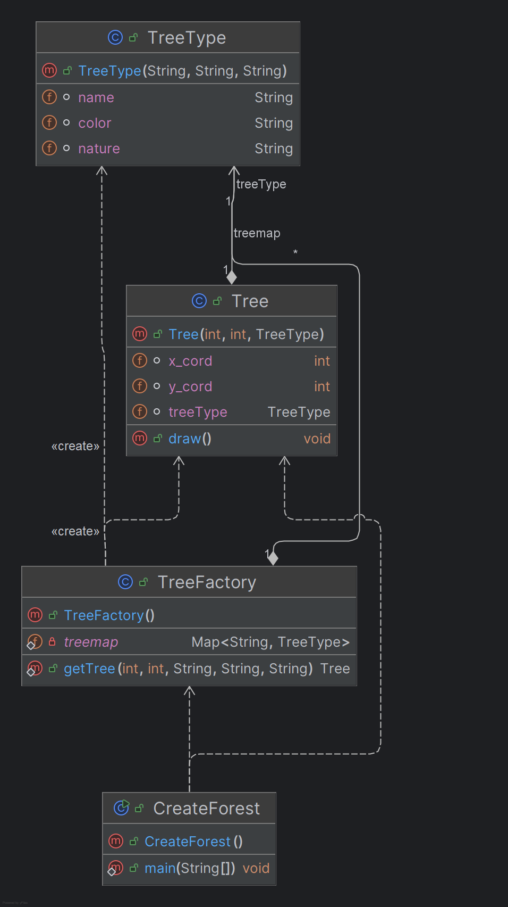

There are intrinsic and extrinsic data changes

Where the Tree types might be shared in most of the cases(In forest the close proximity will be with same type of tress)
> Better to share those values with help of factory and reuse it

Extrensic preoperties are on anothere side which will be changing its states rapidly like the coordinates.
> Its a rapidly changing behaviour

